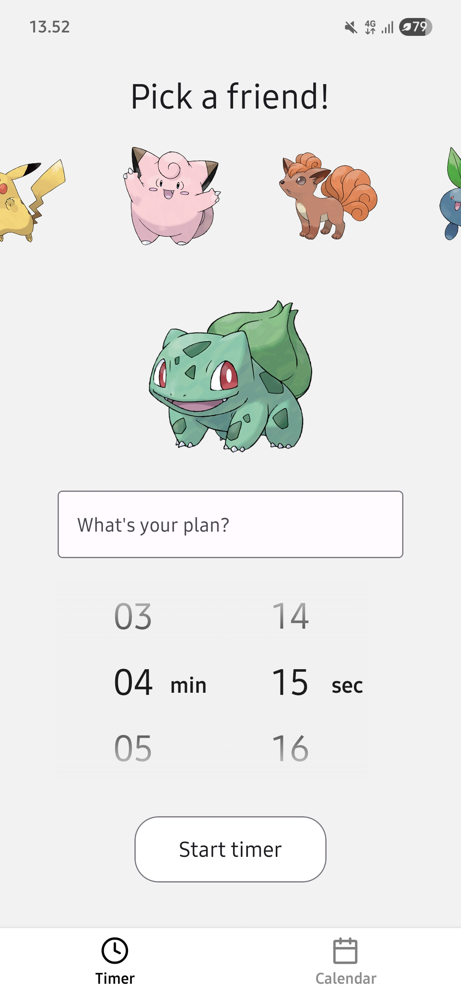
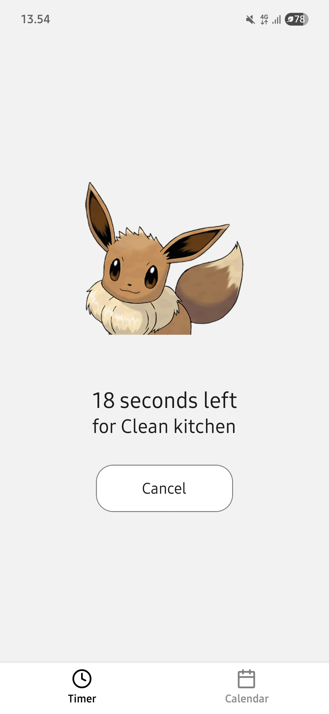
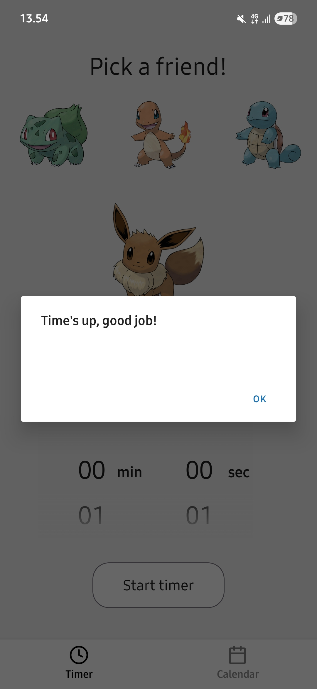
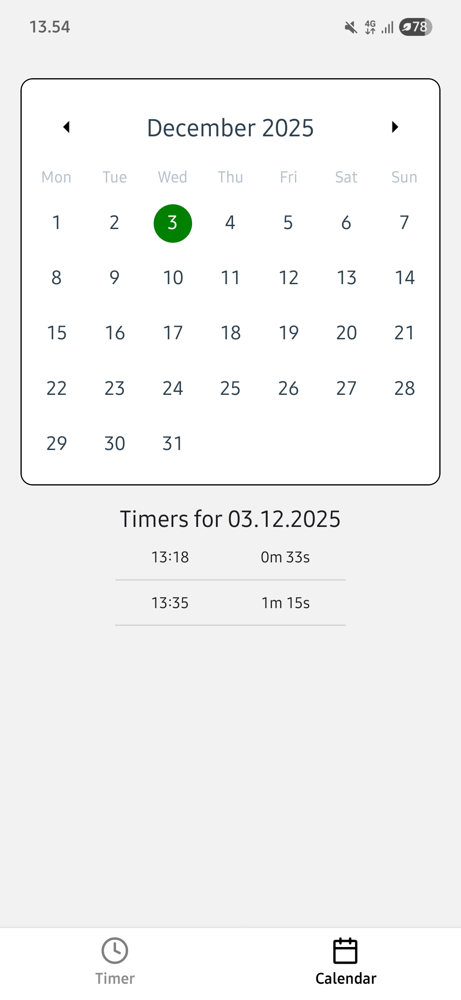

# Visual Timer App
This is my project for Mobile Programmin course. The app is a countdown timer where you can choose a Pokemon to get color when timer runs in seconds. It offers better visual indication of time while your screen stays active. Completed timers are saved to calendar. Build with Expo, the app is designed to be cross-platform.

   


## Tech Stack
- **Framework**: React Native and Expo
- **Navigation**: React Navigation
- **UI-libraries**: React Native Paper, React Native Calendars, React Native Timer Picker
- **Storage**: AsyncStorage
- **Animation**: React Native Reanianimated
- **External Api**: PokeAPI

## How to get started

Make sure you have installed Node.js and Expo Go on your phone. You can also use Android Emulator by installing Expo CLI:
```bash
npm install --global expo-cli
```
Clone repository and install dependencies
```bash
git clone https://github.com/anmattila/visual-timer.git
cd visual-timer
npm install
```
Start Expo
```bash
npx expo start
```

The plan is to build more features in the future. Have fun with the app!
